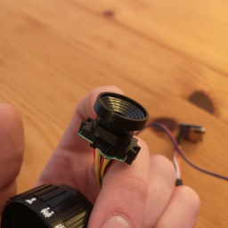

# CMOS Holga

Some time ago, an old friend reminded me of a project I had completely
forgotten about, in which I made an analogue 35mm camera out of an empty
stove matchbox.  The resulting photos were nothing to write home about,
but the fact that it worked at all felt good, and the mere mention of it
by a friend more than ten years later proves that it left a lasting
impression.

A lot has happened since then, my life has changed, my knowledge and
skills have developed.  Time for a follow-up project!

## What is this all about?

Before I show you the result, a few words about the terms used in the
title.

### CMOS

Complementary metal–oxide–semiconductor (CMOS) technology is used for
constructing integrated circuit (IC) chips, including microprocessors,
microcontrollers, memory chips and other digital logic circuits.  CMOS
technology is also used for analog circuits such as image sensors.

### Holga

The Holga is a medium format 120 film camera, made in Hong Kong, known
for its low-fidelity aesthetic.

The Holga's low-cost construction and simple meniscus lens often yields
pictures that display vignetting, blur, light leaks and other
distortions.  The camera's limitations have brought it a cult following
among some photographers, and Holga photos have won awards and
competitions in art and news photography.

### Mix and match!

As if it wasn't obscure enough to use a Holga, I finally decided to
bring Nintendo into the mix.  I dug out my old GameBoy Camera and
removed it's image sensor, the imfamous Mitsubishi M64282FP.  The
M64282FP is a 128×128 pixel CMOS image sensor with built-in image
processing and analog image output tuning functions.  It can detect an
image and process the image simultaneously as human retinas can.

I used an STM32F401 MCU to read out the image data and save the final
pictures to an SD card via SPI. This is partly because I still have some
in stock, and partly because I am familiar with the product family.

In any case, I quickly got some viable results and was motivated to
finish the project.

### Conclusion

In the end, there was not much left of the Holga.  The large lens was no
use for the tiny image sensor, so I decided to adapt the optics from the
GameBoy camera.  It was still a good choice.  The Holga is very cheap to
get and the housing is very light and has enough space for the
electronics.

I could certainly improve the firmware to output JPEGs directly instead
of Portable Grey Map (PGM) files, for example, but overall I am very
happy with the result.  The CMOS Holga is portable, super lightweight
and creates quirky black and white images with a charm of their own.
The camera has no display, no automatic exposure control and no
adjustable focus – it just offers the raw basics of a simple
point-and-shoot camera.  No extras, no gimmicks – just what I had in
mind.

## Gallery

Click on the images to view them in full resolution.

### Development stage

### Shots

More to follow.

